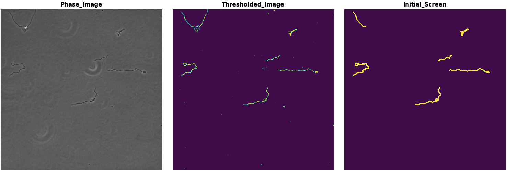

# Borrelia Cell Segmentation
## Preamble
This is a pipeline developed to segment single *Borrelia* cells from phase contrast microscopy. 

Package is by Joshua McCausland in the Christine Jacobs-Wagner laboratory, 2023. Four functions (two primary functionalities: loading ND2 images and fluorescence background subtraction) are authored by Alexandros Papagiannakis, also in the Jacobs-Wagner laboratory.

###Installation
From the private Jacobs-Wagner server, navigate to N:/Common/CodeRepository/Python in the terminal then run the line below.
```bash
python -m pip install Borrelia_Cell_Segmentation/
```

If you want to install a version update of this code and upgrade the version you *currently* have, you can run this line.
```bash
python -m pip install Borrelia_Cell_Segmentation/ -U
```

## Patch 1.1, 2023-07-21
General workflow improvements 
1) Calling the class is more streamlined with all arguments defined in the line rather than used as **kwargs.
2) Made a new function named archive_cells, when one needs to produce binary masks without any additional screening parameters.
3) Added the option to remove linescans from analysis consideration.
4) Normalized intensity by cell area is now incorporated as part of the base code.
5) If the code detects saturated pixels in cell masks, those masks are removed from consideration.

## Workflow
- The logic of the pipeline is to call the class with your imaging parameters and segmentation options. It will initiate the process by making a blank dataframe.

    ```python
    #load the borrelia cell segmentation function.
    from Borrelia_Cell_Segmentation import borrelia_cell_segmentation as bsc
    from Borrelia_Cell_Segmentation import nd2_to_array

    # intialize the class by calling your specific conditions.
    sc = bsc(px_size = 0.065, minimum_length = 5)
    ```

- You then feed the filename and stack of phase contrast images to the class, where it will assess the threshold of all images in the stack, then label each mask with an independant ID.
    ```python
    sc(filename,phase_images)
    ```

- Following, you call the class once more with the corresponding fluorescent images from your experiment. It will populate the internal dataframe with all cell metrics (cell coordinates, skeleton, a fluorscent linescan, mean intensity, etc.)
    ```python
    sc.screen_cells(signal_images)
    ```
- When you are done analyzing all your images, you can export the final dataframe. 
    ```python
    df = sc.return_df()
    ```

### Example usage
This script is optimzied to work with Nikon *nd2* files. If your microscopy setup exports *tif* files, make sure you convert those to a stack of float32 phase/fluorscent images before loading into the pipeline.

Examples of testing thresholds and iterating through multiple different conditions are at the end of this document.
```python
import numpy as np
import pandas as pd
from matplotlib import pyplot as plt
from Borrelia_Cell_Segmentation import borrelia_cell_segmentation as bcs
from Borrelia_Cell_Segmentation import nd2_to_array
import os,glob

filelist = glob.glob('RawData/*.nd2')
sc = bcs(back_sub = 1,threshold = 'adaptive')
for file in filelist:       
    filename = os.path.basename(file).removesuffix('.nd2')
    print(f'Currently analyzing {filename}.')
    imgs = nd2_to_array(file)
    images = imgs[2]
    channels = imgs[3]
    phase = np.array([image[channels[0]].astype('float32') for _,image in images.items()])
    fluor = np.array([image[channels[1]].astype('float32') for _,image in images.items()])

    sc(filename,phase)
    sc.screen_cells(fluor)
df = sc.return_df()
df.to_pickle('Replicate_2.pkl')
df.to_csv('Replicate_2.csv')
df.groupby('filename').size()
```


## Parameters
### Initialization options
When you initialize the script, you can provide custom inputs according to your experimental design. Below are the current options you can specify upon calling bsc().
- **minimum_size**: This is the area in square pixels. This is an easy, quick filter to remove small particles from Otsu. Default is 500 px^2^.
- **minimum_length**: This is the minimum cell length. *Borrelia* cells are very long and thus easy to filter by length. Default is 5 $\mu$m.
- **maximum_width**: The largest possible average cell width to screen for. Default is 0.55 $\mu$m
- **px_size**: Default is our lab's pixel size, 0.065 $\mu$m/pixel. 
- **instantaneous_max_width**: This checks to see whether any abberations occur along the mask. No part of a *Borrelia* cell can be larger than the default value of 1 $\mu$m.
- **threshold**: Specify the thresholding method. Options are *'batch_otsu'*, *'otsu'*, *'multiotsu'*, and *'adaptive'*. The default is *'batch_otsu'*.
    - *'batch_otsu'*: This calculates a single otsu threshold over the entire image array together. Faster if you have many images that are similar in scale.
    - *'otsu'*: This iterates through every single image and calculates an Otsu threshold for each.
    - *'multiotsu'*: Calculates a single otsu threshold for the entire image array similar to 'batch_otsu'. The difference is that this uses Numpy's multiotsu function, generating two thresholds given the histogram rather than one. I pick the lower of the two. This is useful if your phase contrast images have many bright spots that confound a single otsu.
    - *'adaptive'*: Uses an adaptive threshold by scanning the image with a 15-kernel window. Helpful in low dynamic range images, but it tends to cut cells short. 
- **thresh_adjust**: if you want to change the Otsu threshold, make a multiplier. Default is 1, but can be 1.015 for example.
- **back_sub**: Change to ```True``` if you want to subtract the background from every image before measuring intensity. This is a simple background subtraction that measures the mean background.
- **otsu_bins**: Change the number of bins for otsu thresholding calculation. Default is 25.
- **remove_out_of_focus_cells**: Change to ```False``` if you don't want to remove cells that are out of focus. For the most part, this is useful for removing cells that are mostly background signal. This means if you are imaging a negative control, it will remove ALL the cells. Change to 0 when you have such a control present.
- **remove_linescans**: Change to ```True``` if you don't want to include linescans in your analysis. If you are analyzing cells with an aberrant shape where skeletons won't be reliable, this is helpful to toggle off.

### Class functions
- Intialization. Covered above in options. kwargs are optional inputs.
    ```python
    sc = bsc(**kwargs)
    ```

- Threhold testing. I've found that imaging on different microscopes or even differnet days can produce variable results between experiments. In this function, you can specify all of the input options above in various combinations to test how well they segment cells in a given condition. For this, you input:
  - **filename**. Required. This is for saving the files afterward for reference. I use the source filename of the condition I'm testing.
  - **phase_images**. Required. This is the array of phase contrast images you're interested in testing. 
  - **image-num**. If you have a particular image you are interested in testing, specify it here. Default is the first image in the array.
  - **threshold**. Options include *'batch_otsu'*, *'otsu'*, *'multiotsu'*, and *'adaptive'*. If nothing is specified, then the default thresholding method from initialization is called.
  - **otsu_bins**. The number of bins to calculate the Otsu threshold. Default is 25 bins.
  - **thresh_adjust**. You can specify a single value (such as 1, 1.5, 0.95, etc) that can adjust the calculated Otsu threshold if needed. Default is 1.
    ```python
    sc.test_thresholding_method(filename,phase_images,image_num=0,threshold = None,otsu_bins = None,thresh_adjust = None)
    ```

- Calling. Use this to load a new set of phase contrast images and label them. Note that if you are iterating through several conditions, you can tweak thresholding parameters to accomodate each file if your experiment needs that.
    ```python
    sc(filename,phase_images,threshold = None,thresh_adjust = None,otsu_bins = None,minimum_length = None)
    ```

- Meaurements. Call this after loading phase images to gather metrics on all current cells.
    ```python
    sc.screen_cells(signal_images)
    ```

- Archive current masks. If you want to produce binary masks and just need to archive what the class has identified in phase images, then call this function instead of ```screen_cells``` above.
    ```python
    sc.archive_cells()
    ```

- Save binary images. If you feel you need to manually segment the remaining masks to refiene analysis further, you can export the current state of all segmentations for further editing in FIJI/ImageJ. This relies on having *previously* run through all images with **calling** above, for it needs to know the shape of the binary structure to save with.
    ```python
    sc.save_binary()
    ```

- Read binary images. If you feel like you need to manually segment the remaining masks to refine analysis further, you can export the current state of all your segmentations, edit those masks as necessary, then read them back with the appriopriate filename and source phase images. 
    ```python
    sc.read_binary(binary_images,filename,phase_images):
    ```

- Return the pixel size for the experiment. I foudn that I want to retrieve the pixel size for downstream applications sometimes. 
    ```python
    pixel_size = sc.pixel_size
    ```
- Return the dataframe once analysis is complete. If ```save_params``` is set to ```True```, this will also save a text files with *all* parameters used for segmentation for your reference (named "Segmentation_Params.txt").
    ```python
    dataframe = sc.return_df(save_params=False)
    ```

- Load the parameters from a previous experiment. If you have a single list of parameters that you want to easily preserve between conditions or experiments, you can load the text file with the last batch of parameters. Simple specify the file path of the text file and it will load those parameters in.
    ```python
    sc.load_parameters(file)
    ```

- Make a demograph of all cells in the dataframe. This will sort all entries by cell length then produce an array of linescan data, which is plotted with ```imshow``` and saved as a pdf. You can edit large scale details for this as shown in the code block's default values and further explained below. This also exports the demograph structure as well as the pyplot figure and axis if you want to play with the demograph in more detail.
  - **color_map**: Default is 'ocean,' but it can be whatever python color map suits your needs best.
  - **lut_min**: The minimum Z-score to scale the color map. Default is -2.5.
  - **lut_max**: The maximum Z-score to scale the color map. Default is 3.
  - **figure_size**: The size of the figure in inches, w*h. Default is [5,3]. Supply as list or tuple.
  - **savename**: The name to save the demograph.
  - **savedemo**: Default is 1. If you don't want to save the demograph, change to 0.
    ```python
    demograph, figure, axis = sc.make_demograph(color_map = 'ocean',lut_min = -2.5,lut_max = 3,figure_size = [5,3],savename = 'Cell',savedemo=1)
    ```

- In a number of cases in our lab, we wish to analyze the amount of signal integrated midcell for peptidoglycan stains. This bit of code will identify any peaks midcell from a smoothed linescan, analyze the fraction of integrated intensity midcell vs. the whole cell, and look to see whether there is any intensity difference between the two halves of the cell. You can specify the rolling average window for the smoothed linescan using ```window_size```.
\
    As noted from the text above, this appends three new columns to the original dataframe: *smoothlinescan*, *peak_width*, *fraction_peak_intensity*, and *half_cell_difference*. 
    ```python
    dataframe = sc.analyze_linescan_signal(window_size = 10) #int
    ```

- Finally, if you wish to add onto an existing dataframe, or analyze a current dataframe with any of these additional functions you can load an old dataframe into the class by calling a filename string, from which it will load the file.
    **NOTE**. The dataframe must have the columns specified above in the output from the example script.
    ```python
    sc.load_dataframe(file) #string
    ```

### Additional Examples
#### Threshold Testing
Below are a couple of code chunks showing how I would test the threshold parameters for a given condition. In this experiemnt, I have 8 ND2 files from 8 different conditions that segment differently. I first import my relevant packages then load the relevant phase image array. Note that the **borrelia_cell_segmentation** class is initialized here.
```python
import numpy as np
import pandas as pd
from matplotlib import pyplot as plt
from Borrelia_Cell_Segmentation import borrelia_cell_segmentation as bcs
from Borrelia_Cell_Segmentation import nd2_to_array
import os,glob
import time

filelist = glob.glob('RawData/*.nd2')
file = filelist[7]
sc = bcs(back_sub = 1,threshold = 'adaptive')
filename = os.path.basename(file).removesuffix('.nd2')
imgs = nd2_to_array(file)
images = imgs[2]
channels = imgs[3]
phase = np.array([image[channels[0]].astype('float32') for _,image in images.items()])
```

Once the image array is loaded, I have a code chunk that next just calls *test_thresholding_methods* to experiment with my thresholding parameters until I dial in the best one for each condition. I have a series of comments above the line where I note what conditions worked best.
```python
'''
Final thresholds that I have picked for a batch_otsu:
    -Bb144_1hr: 1.7
    -Bb144_2hr: 1.4
    -Bb144_4hr: 0.95
    -Bb144_8hr: 1.85
    -Bb54_1hr: 1.1, otsu_bins = 100 
    -Bb54_2hr: 1.7
    -Bb54_4hr: 1.65
    -Bb54_8hr: 1.8
'''
sc.test_thresholding_method(filename,phase,image_num = 30,threshold = 'multi_otsu',thresh_adjust = 1,otsu_bins = 100)
```



### Iterating through multiple conditions
Once each individualized condition is determined, you can easily then setup a for loop to apply each unique thresholding case to the relevant files. In my case, I define a dictionary with the filename keys specifying what my thresholding methods are. 
```python
filelist = glob.glob('RawData/*.nd2')

# I list the customized otsu threshold then the number of bins for each, 
# determined by the threshold setup above.
strain_specifications = {
    'Bb144_1hr': ['batch_otsu',1.7,25,5],
    'Bb144_2hr': ['batch_otsu',1.4,25,5],
    'Bb144_4hr': ['batch_otsu',0.95,25,6],
    'Bb144_8hr': ['multi_otsu',1,100,10],
    'Bb54_1hr': ['adaptive',1,25,5],
    'Bb54_2hr': ['batch_otsu',1.7,25,5],
    'Bb54_4hr': ['batch_otsu',1.65,25,6],
    'Bb54_8hr': ['multi_otsu',1,100,10]
}

sc = bcs(back_sub = 1,threshold = 'batch_otsu')
for file in filelist: 
    start = time.time()    
    filename = os.path.basename(file).removesuffix('.nd2')
    strain_specs = strain_specifications[filename]
    print(f'Currently analyzing {filename}.')
    imgs = nd2_to_array(file)
    images = imgs[2]
    channels = imgs[3]
    phase = np.array([image[channels[0]].astype('float32') for _,image in images.items()])
    fluor = np.array([image[channels[1]].astype('float32') for _,image in images.items()])

    sc(filename,phase,threshold = strain_specs[0],thresh_adjust=strain_specs[1],otsu_bins = strain_specs[2],minimum_length = strain_specs[3])
    sc.screen_cells(fluor)
    end = time.time()
    print(f'{filename} took {(end-start)/60:.2f} min.')
df = sc.return_df()
sc.save_binary()
df.to_pickle('Replicate_1.pkl')
df.to_csv('Replicate.csv')
```

### Loading binary masks for analysis.
In my case, I also wanted to refine my segmentations with manual curation. I exported all the binary masks, edited them in FIJI, then loaded them again here for my final dataframe. Edit as necessary for your purposes.
```python
filelist = glob.glob('RawData/*.nd2')
binary_filelist = glob.glob('Binary/*.tif')

sc = bcs(back_sub = 1,threshold = 'batch_otsu')
for file,binary in zip(filelist,binary_filelist):
    start = time.time()
    filename = os.path.basename(file).removesuffix('.nd2')
    print(f'Currently analyzing {filename}.')
    imgs = nd2_to_array(file)
    bws = imread(binary)
    images = imgs[2]
    channels = imgs[3]
    phase = np.array([image[channels[0]].astype('float32') for _,image in images.items()])
    fluor = np.array([image[channels[1]].astype('float32') for _,image in images.items()])
    sc.read_binary(bws,filename,phase)
    sc.screen_cells(fluor)
    end = time.time()
    print(f'{filename} took {(end-start)/60:.2f} min.')
df = sc.return_df()
df.to_pickle('Replicate_1.pkl')
df.to_csv('Replicate.csv')
```

### Making demographs from multiple conditions
Since the class function only makes *one* demograph from the entire dataframe, you should also be able to make your own demograph if you have more than one condition. Below is just an example code chunk of how I make my demographs.
```python
cell_df = pd.read_pickle('Replicate_1.pkl')
px_size = 0.065

fig, axs = plt.subplots(nrows = 2,ncols = 4,figsize=(20,10),layout = 'constrained')
for ax,grp in zip(axs.ravel(),df.groupby('filename')):
    grp_df = grp[1]
    grp_df['sizes'] = grp_df.linescan.apply(lambda x: x.shape[0])
    grp_df = grp_df.sort_values('sizes')
    grp_df = grp_df.reset_index()


    demo = np.empty([grp_df.sizes.max()+1,grp_df.shape[0]])
    demo[:] = np.nan
    inds = []
    half_width = np.ceil(grp_df.sizes.max()/2).astype(int)
    for index,row in grp_df.iterrows():
        linescan = row.linescan
        linescan_bottom = np.floor(len(linescan)/2).astype(int)
        linescan_top = np.ceil(len(linescan)/2).astype(int)
        demo[half_width-linescan_bottom:half_width+linescan_top,index] = (linescan-linescan.mean())/linescan.std()

    cax = ax.imshow(demo,cmap='ocean',vmin = -2.5,vmax=3, aspect="auto")
    midpoint = np.ceil((grp_df.sizes.max()+1)/2)
    ytick_locations = [midpoint+midpoint,midpoint-midpoint, midpoint-midpoint/2, midpoint, midpoint+midpoint/2]
    ax.yaxis.set_ticks(ytick_locations,np.round((ytick_locations-midpoint)*px_size,2))
    ax.set_ylabel('Cell position ($\mu$m)')
    ax.set_xlabel('Cell number')
    ax.set_title(grp[0])
    ax.spines[['top','right']].set_visible(False)
    ax.spines[['bottom','left']].set_linewidth(1.2)

    fig.tight_layout(h_pad=2.5)
    fig.subplots_adjust(right=0.8)
cbar_ax = fig.add_axes([0.85, 0.35, 0.015, 0.3])
fig.colorbar(cax, cax=cbar_ax,label='Z Score')
plt.savefig('AllDemos.pdf',dpi=600)
```

